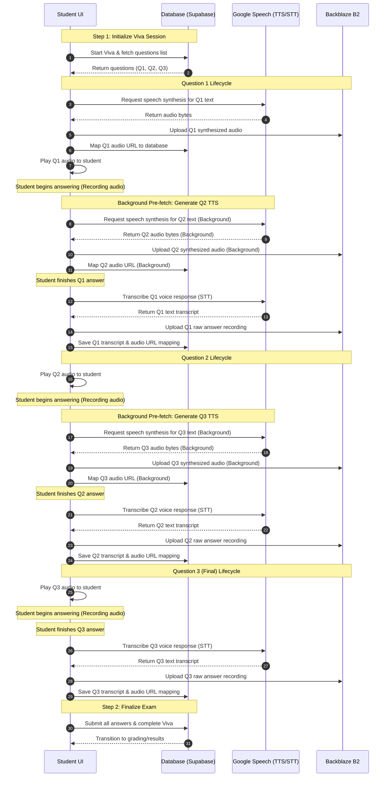

# Wachsen

Wachsen is a comprehensive, exam preparation, scheduling, and revision platform. The application is built to help students plan schedules, execute exam-taking sessions, scan physical questions, generate conceptual flashcards via AI, and track revision logs all in one place.

## Inspiration
Wachsen was inspired by the realization that modern education needs to move beyond simple multiple-choice questions (MCQs). True assessment lies in a student's ability to vocalize and defend their knowledge. In university settings, **Viva Voce (oral examinations)** are the gold standard for testing depth of knowledge, but they are incredibly time-consuming and expensive to scale. We wanted to build an automated, high-fidelity AI-driven oral exam simulator—mimicking a real human interviewer—that scales globally.

## What it does
Wachsen is a complete exam preparation workspace featuring robust schedules, document scanners, and study logs. The crown jewel is our **Oral Viva Examination Simulator**:
* **Interactive AI Interviewer**: Speaks questions in natural, slow-paced human voices using premium Google Cloud Text-to-Speech (Chirp3 HD).
* **Voice-Activated Student Responses**: Captures oral answers through browser-native MediaRecorder and streams them for real-time translation (STT).
* **Autoplay Resiliency**: Intelligently detects browser sandboxing restrictions (Autoplay policies) and displays a clean "Click to Play" prompt instead of skipping questions.
* **Full Revision Pipeline**: Generates theory concept flashcards, indexes scanned question sheets, and tracks revision logs.

## How we built it
We integrated a robust, modular technology stack:
* **The Storage Backbone (Backblaze B2)**: Used Backblaze B2 as our private storage vault for raw voice response recordings and synthesized question files. We built an Express-based secure proxy (`/api/upload-to-b2`) that dynamically requests short-lived (1-hour) authorized tokens to securely stream audio back to the client.
* **Genblaze Ingestion Pipeline**: Constructed a Python media processor (`generate_viva_media.py`) built around `ObjectStorageSink` and `S3StorageBackend` (configured for B2 us-east-005). Genblaze ingests audio assets, cataloging them under clean, hierarchical namespaces (`viva/{userId}/{examId}`).
* **Google Speech APIs**: Synthesized natural oral questions (TTS) using premium Chirp3 voices, and transcribed WebM/Opus audio responses (STT) by reading sample rates dynamically from audio container headers.

### System Architecture & Flow




## AI Providers & Models Used
Wachsen leverages a hybrid AI model mesh to handle natural language understanding, high-fidelity audio synthesis, and real-time student transcription:

* **OpenAI (via Mesh API)**
  - **Models**: `gpt-4o` (or custom configured models).
  - **Usage**: Powers the **AI Tutor** for grading subjective assessments, generating interactive chat explanations, constructing dynamic daily/monthly study calendars in the dashboard, and generating conceptual flashcards.
* **Google Cloud Text-to-Speech (TTS)**
  - **Models**: `en-US-Chirp3-HD-Achernar` (friendly US female voice) and `en-US-Chirp3-HD-Algenib` (friendly US male voice).
  - **Usage**: Synthesizes the natural, conversational oral questions spoken by the AI interviewer during Viva Voce examinations.
* **Google Cloud Speech-to-Text (STT)**
  - **Models**: `Speech-to-Text v1` (optimized for containerized WebM/Opus stream processing).
  - **Usage**: Transcribes spoken student answers directly from browser recordings, automatically resolving the audio container headers to produce precise English transcripts.

## Backblaze B2 & Genblaze Core Integration
Wachsen separates media pipeline storage from transactional application databases. This is achieved by combining Backblaze B2 with the Genblaze ingestion framework to serve as a secure, scalable media layer:

1. **Genblaze Ingestion Pipeline (`Pipeline.ingest`)**:
   - When a student completes an oral response or generates an interviewer voice, the raw media asset is packaged.
   - Using Genblaze's `ObjectStorageSink` paired with the `S3StorageBackend` (specifically pointed to the Backblaze B2 `us-east-005` region endpoint), files are ingested programmatically.
   - Genblaze handles namespace segmentation, index catalogs, and generates playback manifest configurations (`manifest_uri`) for high-fidelity audio playing.
2. **Backblaze B2 Secure Storage**:
   - **Interviewer Questions**: Genblaze uploads all synthesized question audios directly to a private Backblaze B2 bucket under structured prefixes (e.g., `viva/{userId}/{examId}/viva-tts-q-{index}.mp3`).
   - **Student Voice Recordings**: Raw audio recorded by the student (in `WEBM_OPUS` format) is securely proxy-uploaded directly to B2 (e.g., `viva/{userId}/{examId}/user-viva-a-{index}.webm`).
3. **Double-Ended Proxy Security (`/api/upload-to-b2`)**:
   - To keep bucket credentials hidden from the client, the frontend never connects to Backblaze B2 directly.
   - All upload and download actions pass through our backend Express proxy endpoint `/api/upload-to-b2`.
   - For file serving, the proxy requests a short-lived, single-file download authorization token from the B2 API (valid for 1 hour) and streams the private binary audio directly to the client. This allows secure, cross-origin playback via `/api/upload-to-b2?path=...` without public bucket exposure.

## Challenges we ran into
1. **Browser Autoplay Policies**: Modern browsers block programmatic `.play()` without recent user gestures. On timers or automatic slide transitions, this would block the oral questions entirely. We solved this by trapping `NotAllowedError` exceptions and displaying a dynamic "Autoplay blocked. Click to play question" interactive central button.
2. **Microphone Pitch Warps**: Legacies of hardcoding audio configs (forcing `48000Hz` sample rates) caused client microphones of different rates (like 16kHz or 44.1kHz) to record warped pitch files. This led to legacy STT models transcribing clear words like *"acceleration"* into gibberish. We resolved this by stripping manual overrides and allowing Google STT to parse the sample rate dynamically from the container headers.
3. **Session Interruption & Recovery**: If a user's tab closed during an ongoing exam, client state would be lost. We fixed this by backing up progress (both transcripts and audio mapping) in the DB and SessionStorage on every slide transition, enabling transparent recovery.

## Accomplishments that we're proud of
* **Zero-Overlap Voice Pipeline**: Engineered a highly resilient audio controller that safely stops active playback before starting new tracks, eliminating audio echoing and overlapping voices.
* **Securing Private Buckets**: Achieved a 100% secure file structure. Raw audio is uploaded and stored in private B2 storage without client-side API key exposures.
* **Pre-Fetching Engine**: Built a background queue that generates and maps TTS assets for the *next* question while the student is busy recording their answer for the *current* question, keeping transitions instant.

## What we learned
* **Dynamic Header Resolution**: Containerized formats like `WEBM_OPUS` hold their own sample rate data. Letting cloud decoders auto-parse headers is vastly more resilient than hardcoding client rates.
* **Safe Promise Cancellation**: When pausing HTMLAudioElements, it is critical to catch `AbortError` promises to avoid breaking UI state trees.

## What's next for Wachsen
* **Vertex AI Chirp Integration**: Upgrade the STT engine to Google Cloud's Chirp model to handle heavy background static and non-native accents with even higher accuracy.
* **Offline Recording Queues**: Enable local offline caching of voice recordings via Service Workers, syncing them back to B2 and Supabase only when network connection is restored.

## Live AI Features (ChatGPT & Mesh API)


The live, interactive features inside the application run on **OpenAI/ChatGPT models** routed via the **Mesh API** 
* **AI Tutor & Evaluation**: Subjective assessment grading and interactive chat explanations utilize ChatGPT models.
* **Smart Study Planner**: Generates daily and monthly roadmaps on demand using ChatGPT.
* **Concept Card Generation**: Creates custom theory flashcards to reinforce knowledge.

## Core Features

- **Exam Planner & Dashboard**: Features robust calendar schedules (daily, weekly, monthly, and mentor timelines) for tracking upcoming tasks.
- **Dynamic Font & Theme Engine**: Supports responsive clamp-based typography scaling and a dark/light visual toggle.
- **Physical Document Scanner**: Decodes and scans question sheets using integrated PDF.js rendering.
- **AI Tutoring & Evaluations**: Gets subjective answers graded and conceptual doubts solved using ChatGPT via Mesh API.
- **Interactive Concept Cards**: Dynamically generates and formats study flashcards for topic revision.
- **Premium Subscription & Payments**: Multi-tier billing flows (Lite, Rise, Peak) configured with Razorpay API endpoints.

## Tech Stack

- **Frontend**: React, Vite, Tailwind CSS, TypeScript, TanStack Query, Recharts, Lucide Icons, MathJax (math typesetting).
- **Backend API**: Express (Node.js) server.
- **Database & Auth**: Supabase (Postgres tables, schema validation, avatar storage bucket).

Wachsen was designed and engineered in close collaboration with state of the art AI systems. The application was built utilizing Codex for UI/UX layouts, responsive component design, and backend database architecture help.


## Getting Started

### 1. Prerequisites
Ensure you have Node.js installed on your system.

### 2. Installation
Install the project dependencies using npm:
```bash
npm install
```

### 3. Environment Setup
Duplicate the `.env.example` file in the root directory, rename it to `.env`, and provide your own credentials:
```bash
cp .env.example .env
```

### 4. Running the Project
The project uses concurrent client and server tasks. You can run them locally:

- **Frontend Dev Client** (Vite server running on port 3000):
  ```bash
  npm run dev
  ```

- **Backend Express Server**:
  ```bash
  npm run api
  ```
  or
  ```bash
  node server.js
  ```

## Environment Configuration

| Variable Name | Description | Source |
| --- | --- | --- |
| `VITE_SUPABASE_URL` | The public URL endpoint for your Supabase project instance. | Supabase Dashboard |
| `VITE_SUPABASE_ANON_KEY` | Anonymous public API access key for client authentication. | Supabase Dashboard |
| `SUPABASE_PROJECT_ID` | Project reference ID for Supabase services. | Supabase Dashboard |
| `MESH_API_KEY` | Secret access token for AI Chat Completion model endpoints. | Mesh API Console |
| `MESH_API_URL` | Chat completions endpoint URL. | Mesh API Console |
| `MESH_MODEL` | The default text completion model (e.g. GPT-5.4). | Mesh API Console |
| `VITE_RAZORPAY_KEY_ID` | Client-side publishable key for loading the checkout script. | Razorpay Dashboard |
| `RAZORPAY_KEY_ID` | Server-side Razorpay merchant key identifier. | Razorpay Dashboard |
| `RAZORPAY_KEY_SECRET` | Secret api credential token for backend signature verification. | Razorpay Dashboard |
